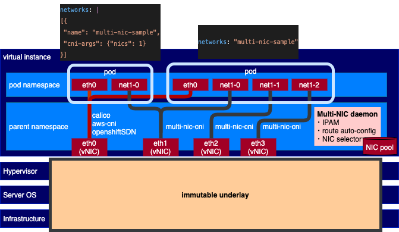

- [Multi-NIC CNI](#multi-nic-cni)
  - [MultiNicNetwork](#multinicnetwork)
  - [Usage](#usage)
      - [Requirements](#requirements)
      - [Install operator](#install-operator)
        - [1. Build CNI operator](#1-build-cni-operator)
        - [2. Build CNI daemon](#2-build-cni-daemon)
        - [3. Deploy operator with daemon config](#3-deploy-operator-with-daemon-config)
      - [Deploy MultiNicNetwork resource](#deploy-multinicnetwork-resource)
      - [Check connections](#check-connections)
# Multi-NIC CNI
Attaching secondary network interfaces that is linked to different network interfaces on host (NIC) to pod provides benefits of network segmentation and top-up network bandwidth in the containerization system. 

Multi-NIC CNI is the CNI plugin operating on top of [Multus CNI](https://github.com/k8snetworkplumbingwg/multus-cni). However, unlike Multus, instead of defining and handling each secondary network interface one by one, this CNI automatically discovers all available secondary interfaces and handles them as a NIC pool.
With this manner, it can provide the following benefits.

i) **Common secondary network definition**: User can manage only one network definition for multiple secondary interfaces with a common CNI main plugin such as ipvlan, macvlan, and sr-iov. 

ii) **Common NAT-bypassing network solution**: All secondary NICs on each host can be assigned with non-conflict CIDR and non-conflict L3 routing configuration that can omit an overlay networking overhead. Particularyly, the CNI is built-in with L3 IPVLAN solution composing of the following functionalities.
  1) **Interface-host-devision CIDR Computation**: compute allocating CIDR range for each host and each interface from a single global subnet with the number of bits for hosts and for interface. 
  2) **L3 Host Route Configuration**: configure L3 routes (next hop via dev) in host route table according to the computed CIDR.
  3) **Distributed IP Allocation Management**: manage IP allocation/deallocation distributedly via the communication between CNI program and daemon at each host.

[read more](./document/multi-nic-ipam.md) 

iii) **Policy-based secondary network attachment**: Instead of statically set the desired host's master interface name one by one, user can define a policy on attaching multiple secondary network interfaces such as specifying only the number of desired interfaces, filtering only highspeed NICs. 

[read more](./document/policy.md)



The Multi-NIC CNI architecture can be found [here](./document/architecture.md).
## MultiNicNetwork
The Multi-NIC operator operates over a custom resource named *MultiNicNetwork* defined by users.
This definition will define a Pod global subnet, common network definition (main CNI and IPAM plugin), and attachment policy. 
After deploying *MultiNicNetwork*, *NetworkAttachmentDefinition* with the same name will be automatically configured and created respectively.

```yaml
# network.yaml
apiVersion: net.cogadvisor.io/v1
kind: MultiNicNetwork
metadata:
  name: multi-nic-sample
spec:
  subnet: "192.168.0.0/16"
  ipam: |
    {
      "type": "multi-nic-ipam",
      "hostBlock": 6, 
      "interfaceBlock": 2,
      "vlanMode": "l3"
    }
  multiNICIPAM: true
  plugin:
    cniVersion: "0.3.0"
    type: ipvlan
    args: 
      mode: l3
  attachPolicy:
    strategy: none
  namespaces:
  - default
```

Argument|Description|Value|Remarks
---|---|---|---
subnet|cluster-wide subnet for all hosts and pods|CIDR range|currently support only v4
hostBlock|number of address bits for host indexing| int (n) | the number of assignable host = 2^n
ipam|ipam plugin config| string | ipam can be single-NIC IPAM (e.g., whereabouts, VPC-native IPAM) or multi-NIC IPAM (e.g., [Multi-NIC IPAM Plugin](document/multi-nic-ipam.md#ipam-configuration))
multiNicIPAM| indicator of ipam type | bool | **true** if ipam returns multiple IPs from *masters* key of NetworkAttachmentDefinition config at once, **false** if ipam returns only single IP from static config in ipam block
plugin|main plugin config|[NetConf](https://pkg.go.dev/github.com/containernetworking/cni/pkg/types#NetConf) + plugin-specific arguments | main plugin integration must implement [Plugin](./plugin/plugin.go) with GetConfig function
attachPolicy|attachment policy|policy|[strategy](document/policy.md) with corresponding arguments to select host NICs to be master of secondary interfaces on Pod
namespaces|list of namespaces to apply the network definitions (i.e., to create NetworkAttachmentDefinition resource)|[]string|apply to all namespace if not specified. new item can be added to the list by `kubectl edit` to create new NetworkAttachmentDefinition. the created NetworkAttachmentDefinition must be deleted manually if needed.


## Usage
#### Requirements
- Secondary interfaces attached to worker nodes, check terraform script [here](./terraform/)
- Multus CNI installation; compatible with networkAttachmentDefinition and pod annotation in multus-cni v3.8
- For IPVLAN L3 CNI, the following configurations are additionally required
  - enable allowing IP spoofing for each attached interface
  - set security group to allow IPs in the target container subnet
  - IPVLAN support (kernel version >= 4.2)
- Utility tools
  - Environment substitution *envsubst* ([gettext](https://www.gnu.org/software/gettext/))
  - YAML processor *yq* ([yq](https://mikefarah.gitbook.io/yq/))
#### Install operator
##### 1. Build CNI operator
1. Clone the repo and enter the workspace
    ```bash
    git clone https://github.ibm.com/CognitiveAdvisor/multi-nic-cni-operator.git
    cd multi-nic-cni-operator
    ```
2. Make bundle
    ```bash 
    make bundle
    ```
3. Modify `IMAGE_REGISTRY`  Makefile (Makefile) to target image repository for operator
4. For private image registry, follow these additional steps to add image-pulling secret
   1. Put your secret for pulling operator image (`operator-secret.yaml`) to the secret folder
        ```bash
        mv operator-secret.yaml config/secret
        ```
   2. Run script to update relevant kustomization files
      ```bash 
      export OPERATOR_SECRET_NAME=$(cat config/secret/operator-secret.yaml|yq .metadata.name)
      make operator-secret
      ```
5. Build and push operator image
    ```bash
    make docker-build docker-push
    ```
##### 2. Build CNI daemon

1. Modify `IMAGE_REGISTRY` daemon Makefile (daemon/Makefile) to target repository for daemon
2. For private image registry, follow these additional steps to add image-pulling secret
   1. Put your secret for pulling daemon image (`daemon-secret.yaml`) to the secret folder
      ```bash
      mv daemon-secret.yaml config/secret
      ```
   2. Run script to update relevant kustomization files
      ```bash 
      export DAEMON_SECRET_NAME=$(cat config/secret/daemon-secret.yaml|yq .metadata.name)
      make daemon-secret
      ```
3. Build and push daemon image
    ```bash
    # build environment: 
    #   Linux systems with netlink library
    cd daemon
    make docker-build-push
    ```
    This will also build the cni binary and copy the built binary to daemon component.
##### 3. Deploy operator with daemon config
1. For Openshift cluster, assign privileged security context to multi-nic-cni-operator-controller-manager service account
    ```bash
    oc adm policy add-scc-to-user privileged system:serviceaccount:multi-nic-cni-operator-system:multi-nic-cni-operator-controller-manager
    ```
2. Deploy by [kustomize](https://kustomize.io)
    ```bash
    make deploy
    ```

#### Deploy MultiNicNetwork resource
1. Prepare `network.yaml` as shown in the [example](#multinicnetwork)
    
2. Deploy 
   ```bash
   kubectl apply -f network.yaml
   ```
   After deployment, the operator will create *NetworkAttachmentDefinition* of [Multus CNI](multus) from *MultiNicNetwork* as well as dependent resource such as *SriovNetworkNodePolicy*, *SriovNetwork* for sriov plugin.
3. To attach additional interfaces, annotate the pod with the network name
    ```yaml
    metadata:
      annotations:
        k8s.v1.cni.cncf.io/networks: multi-nic-sample
    ```

#### Check connections
1. Deploy concheck driver
    ```bash
    kubectl create -f connection-check/concheck.yaml
    ```
2. Check log
   ```bash
    kubectl logs job/multi-nic-concheck
    ```
    The log should print the connection table like this:
    ```bash
      ###########################################
      ## Connection Check: multinic-sample
      ###########################################
      FROM                            TO                               CONNECTED/TOTAL IPs                            BANDWIDTHs
      gpu-dallas-d5l8c-worker-2-47lzt gpu-dallas-d5l8c-worker-2-5477j  2/2             [192.168.0.2 192.168.64.2]     [ 8.80Gbits/sec 7.81Gbits/sec]
      gpu-dallas-d5l8c-worker-2-47lzt gpu-dallas-d5l8c-worker-2-6dkfv  2/2             [192.168.0.195 192.168.64.195] [ 13.1Gbits/sec 7.55Gbits/sec]
      gpu-dallas-d5l8c-worker-2-47lzt gpu-dallas-d5l8c-worker-2-8wh6z  2/2             [192.168.1.3 192.168.65.3]     [ 7.32Gbits/sec 7.64Gbits/sec]
      gpu-dallas-d5l8c-worker-2-47lzt gpu-dallas-d5l8c-worker-3-rfrs4  0/2             [192.168.128.1 192.168.192.1]  []
      gpu-dallas-d5l8c-worker-2-47lzt gpu-dallas-d5l8c-worker-2-4czvd  2/2             [192.168.0.67 192.168.64.67]   [ 7.39Gbits/sec 8.08Gbits/sec]
      gpu-dallas-d5l8c-worker-2-4czvd gpu-dallas-d5l8c-worker-2-47lzt  2/2             [192.168.0.131 192.168.64.131] [ 10.9Gbits/sec 9.79Gbits/sec]
      gpu-dallas-d5l8c-worker-2-4czvd gpu-dallas-d5l8c-worker-2-5477j  2/2             [192.168.0.2 192.168.64.2]     [ 5.47Gbits/sec 4.96Gbits/sec]
      gpu-dallas-d5l8c-worker-2-4czvd gpu-dallas-d5l8c-worker-2-6dkfv  2/2             [192.168.0.195 192.168.64.195] [ 8.08Gbits/sec 7.72Gbits/sec]
      gpu-dallas-d5l8c-worker-2-4czvd gpu-dallas-d5l8c-worker-2-8wh6z  2/2             [192.168.1.3 192.168.65.3]     [ 7.55Gbits/sec 9.93Gbits/sec]
      gpu-dallas-d5l8c-worker-2-4czvd gpu-dallas-d5l8c-worker-3-rfrs4  0/2             [192.168.128.1 192.168.192.1]  []
      gpu-dallas-d5l8c-worker-2-5477j gpu-dallas-d5l8c-worker-2-6dkfv  2/2             [192.168.0.195 192.168.64.195] [ 8.37Gbits/sec 8.91Gbits/sec]
      gpu-dallas-d5l8c-worker-2-5477j gpu-dallas-d5l8c-worker-2-8wh6z  2/2             [192.168.1.3 192.168.65.3]     [ 10.7Gbits/sec 5.84Gbits/sec]
      gpu-dallas-d5l8c-worker-2-5477j gpu-dallas-d5l8c-worker-3-rfrs4  0/2             [192.168.128.1 192.168.192.1]  []
      gpu-dallas-d5l8c-worker-2-5477j gpu-dallas-d5l8c-worker-2-47lzt  2/2             [192.168.0.131 192.168.64.131] [ 5.61Gbits/sec 9.52Gbits/sec]
      gpu-dallas-d5l8c-worker-2-5477j gpu-dallas-d5l8c-worker-2-4czvd  2/2             [192.168.0.67 192.168.64.67]   [ 6.56Gbits/sec 7.09Gbits/sec]
      gpu-dallas-d5l8c-worker-2-6dkfv gpu-dallas-d5l8c-worker-2-47lzt  2/2             [192.168.0.131 192.168.64.131] [ 10.5Gbits/sec 8.80Gbits/sec]
      gpu-dallas-d5l8c-worker-2-6dkfv gpu-dallas-d5l8c-worker-2-4czvd  2/2             [192.168.0.67 192.168.64.67]   [ 7.02Gbits/sec 9.39Gbits/sec]
      gpu-dallas-d5l8c-worker-2-6dkfv gpu-dallas-d5l8c-worker-2-5477j  2/2             [192.168.0.2 192.168.64.2]     [ 7.81Gbits/sec 7.81Gbits/sec]
      gpu-dallas-d5l8c-worker-2-6dkfv gpu-dallas-d5l8c-worker-2-8wh6z  2/2             [192.168.1.3 192.168.65.3]     [ 9.79Gbits/sec 8.18Gbits/sec]
      gpu-dallas-d5l8c-worker-2-6dkfv gpu-dallas-d5l8c-worker-3-rfrs4  0/2             [192.168.128.1 192.168.192.1]  []
      gpu-dallas-d5l8c-worker-2-8wh6z gpu-dallas-d5l8c-worker-2-47lzt  2/2             [192.168.0.131 192.168.64.131] [ 9.52Gbits/sec 9.03Gbits/sec]
      gpu-dallas-d5l8c-worker-2-8wh6z gpu-dallas-d5l8c-worker-2-4czvd  2/2             [192.168.0.67 192.168.64.67]   [ 9.65Gbits/sec 4.88Gbits/sec]
      gpu-dallas-d5l8c-worker-2-8wh6z gpu-dallas-d5l8c-worker-2-5477j  2/2             [192.168.0.2 192.168.64.2]     [ 7.99Gbits/sec 7.39Gbits/sec]
      gpu-dallas-d5l8c-worker-2-8wh6z gpu-dallas-d5l8c-worker-2-6dkfv  2/2             [192.168.0.195 192.168.64.195] [ 6.56Gbits/sec 6.88Gbits/sec]
      gpu-dallas-d5l8c-worker-2-8wh6z gpu-dallas-d5l8c-worker-3-rfrs4  0/2             [192.168.128.1 192.168.192.1]  []
      gpu-dallas-d5l8c-worker-3-rfrs4 gpu-dallas-d5l8c-worker-2-5477j  0/2             [192.168.0.2 192.168.64.2]     []
      gpu-dallas-d5l8c-worker-3-rfrs4 gpu-dallas-d5l8c-worker-2-6dkfv  0/2             [192.168.0.195 192.168.64.195] []
      gpu-dallas-d5l8c-worker-3-rfrs4 gpu-dallas-d5l8c-worker-2-8wh6z  0/2             [192.168.1.3 192.168.65.3]     []
      gpu-dallas-d5l8c-worker-3-rfrs4 gpu-dallas-d5l8c-worker-2-47lzt  0/2             [192.168.0.131 192.168.64.131] []
      gpu-dallas-d5l8c-worker-3-rfrs4 gpu-dallas-d5l8c-worker-2-4czvd  0/2             [192.168.0.67 192.168.64.67]   []
      ###########################################
    ```
3. Clean up
   ```bash
    kubectl delete pod -n default --selector multi-nic-concheck
    kubectl delete job -n default --selector multi-nic-concheck
    kubectl delete -f connection-check/concheck.yaml
    ```

#### Uninstall operator
 ```bash
 make undeploy
 ```