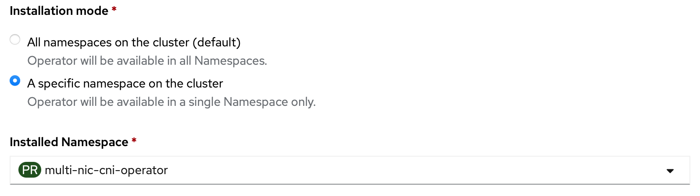

> Documents and source codes for the deprecated domain `cogadvisor.io` are moved to [cogadvisor-net branch](https://github.com/foundation-model-stack/multi-nic-cni/tree/cogadvisor-net)

**official document:** https://foundation-model-stack.github.io/multi-nic-cni.

- [Multi-NIC CNI](#multi-nic-cni)
  - [MultiNicNetwork](#multinicnetwork)
  - [Usage](#usage)
      - [Requirements](#requirements)
      - [Quick Installation](#quick-installation)
        - [by OperatorHub](#by-operatorhub)
        - [by manifests with kubectl](#by-manifests-with-kubectl)
        - [by bundle with operator-sdk](#by-bundle-with-operator-sdk)
      - [Deploy MultiNicNetwork resource](#deploy-multinicnetwork-resource)
      - [Check connections](#check-connections)
        - [Peer-to-peer - *quick test*](#peer-to-peer---quick-test)
        - [All-to-all  - *recommended for small cluster (\<10 HostInterfaces)*](#all-to-all----recommended-for-small-cluster-10-hostinterfaces)
      - [Uninstallation](#uninstallation)

# Multi-NIC CNI
Attaching secondary network interfaces that is linked to different network interfaces on host (NIC) to pod provides benefits of network segmentation and top-up network bandwidth in the containerization system. 

Multi-NIC CNI is the CNI plugin operating on top of [Multus CNI](https://github.com/k8snetworkplumbingwg/multus-cni). However, unlike Multus, instead of defining and handling each secondary network interface one by one, this CNI automatically discovers all available secondary interfaces and handles them as a NIC pool.
With this manner, it can provide the following benefits.

i) **Common secondary network definition**: User can manage only one network definition for multiple secondary interfaces with a common CNI main plugin such as ipvlan, macvlan, and sr-iov. 

ii) **Common NAT-bypassing network solution**: All secondary NICs on each host can be assigned with non-conflict CIDR and non-conflict L3 routing configuration that can omit an overlay networking overhead. Particularyly, the CNI is built-in with L3 IPVLAN solution composing of the following functionalities.
  1) **Interface-host-devision CIDR Computation**: compute allocating CIDR range for each host and each interface from a single global subnet with the number of bits for hosts and for interface. 
  2) **L3 Host Route Configuration**: configure L3 routes (next hop via dev) in host route table according to the computed CIDR.
  3) **Distributed IP Allocation Management**: manage IP allocation/deallocation distributedly via the communication between CNI program and daemon at each host.

[read more](./document/docs/Concept/multi-nic-ipam.md) 

iii) **Policy-based secondary network attachment**: Instead of statically set the desired host's master interface name one by one, user can define a policy on attaching multiple secondary network interfaces such as specifying only the number of desired interfaces, filtering only highspeed NICs. 

[read more](./document/docs/Concept/policy.md)


The Multi-NIC CNI architecture can be found [here](./document/docs/Developer%20Guide/architecture.md).

## MultiNicNetwork
The Multi-NIC operator operates over a custom resource named *MultiNicNetwork* defined by users.
This definition will define a Pod global subnet, common network definition (main CNI and IPAM plugin), and attachment policy. 
After deploying *MultiNicNetwork*, *NetworkAttachmentDefinition* with the same name will be automatically configured and created respectively.

```yaml
# network.yaml
apiVersion: multinic.fms.io/v1
kind: MultiNicNetwork
metadata:
  name: multi-nic-sample
spec:
  subnet: "192.168.0.0/16"
  ipam: |
    {
      "type": "multi-nic-ipam",
      "hostBlock": 6, 
      "interfaceBlock": 2,
      "vlanMode": "l3"
    }
  multiNICIPAM: true
  plugin:
    cniVersion: "0.3.0"
    type: ipvlan
    args: 
      mode: l3
  attachPolicy:
    strategy: none
```

Argument|Description|Value|Remarks
---|---|---|---
subnet|cluster-wide subnet for all hosts and pods|CIDR range|currently support only v4
hostBlock|number of address bits for host indexing| int (n) | the number of assignable host = 2^n
ipam|ipam plugin config| string | ipam can be single-NIC IPAM (e.g., whereabouts, VPC-native IPAM) or multi-NIC IPAM (e.g., [Multi-NIC IPAM Plugin](./document/docs/Concept/multi-nic-ipam.md#ipam-configuration))
multiNicIPAM| indicator of ipam type | bool | **true** if ipam returns multiple IPs from *masters* key of NetworkAttachmentDefinition config at once, **false** if ipam returns only single IP from static config in ipam block
plugin|main plugin config|[NetConf](https://pkg.go.dev/github.com/containernetworking/cni/pkg/types#NetConf) + plugin-specific arguments | main plugin integration must implement [Plugin](./plugin/plugin.go) with GetConfig function
attachPolicy|attachment policy|policy|[strategy](./document/docs/Concept/policy.md) with corresponding arguments to select host NICs to be master of secondary interfaces on Pod
namespaces| (optional) limit network definition application to list of namespaces (i.e., to create NetworkAttachmentDefinition resource)|[]string|if not specified, network definitions will be applied to all namespaces. new item can be added to the list by `kubectl edit` to create new NetworkAttachmentDefinition. the created NetworkAttachmentDefinition must be deleted manually if needed.


## Usage
#### Requirements
- Secondary interfaces attached to worker nodes, check terraform script [here](./terraform/)
- Multus CNI installation; compatible with networkAttachmentDefinition and pod annotation in multus-cni v3.8
- For IPVLAN L3 CNI, the following configurations are additionally required
  - enable allowing IP spoofing for each attached interface
  - set security group to allow IPs in the target container subnet
  - IPVLAN support (kernel version >= 4.2)
#### Quick Installation
##### by OperatorHub
- Kubernetes with OLM:
  - check [multi-nic-cni-operator on OperatorHub.io](https://operatorhub.io/operator/multi-nic-cni-operator)

    

- Openshift Container Platform:
  - Search for `multi-nic-cni-operator` in OperatorHub

    

Recommended to deploy in the same default namespace for [health check service](./health-check/), which is `multi-nic-cni-operator`. 



(available after v1.0.5)

##### by manifests with kubectl
  ```bash
  kubectl apply -f deploy/
  ```
##### by bundle with operator-sdk
  ```bash
  operator-sdk run bundle ghcr.io/foundation-model-stack/multi-nic-cni-bundle:v1.2.4 -n multi-nic-cni-operator
  ```
#### Deploy MultiNicNetwork resource
1. Prepare `network.yaml` as shown in the [example](#multinicnetwork)
    
2. Deploy 
   ```bash
   kubectl apply -f network.yaml
   ```
   After deployment, the operator will create *NetworkAttachmentDefinition* of [Multus CNI](https://github.com/k8snetworkplumbingwg/multus-cni) from *MultiNicNetwork* as well as dependent resource such as *SriovNetworkNodePolicy*, *SriovNetwork* for sriov plugin.
3. To attach additional interfaces, annotate the pod with the network name
    ```yaml
    metadata:
      annotations:
        k8s.v1.cni.cncf.io/networks: multi-nic-sample
    ```

#### Check connections
##### One-time peer-to-peer - *quick test*
1. Set target peer
   
    ```bash
    export SERVER_HOST_NAME=<target-server-node-name>
    export CLIENT_HOST_NAME=<target-client-node-name>
    ```
    
    > If the target peer is not set, the last two of listed nodes will be selected as server and client, respectively.

2. Run the test
    ```bash
    make sample-concheck
    ```
    Example output:
    
    ```python
    # pod/multi-nic-iperf3-server created
    # pod/multi-nic-iperf3-server condition met
    # pod/multi-nic-iperf3-client created
    # pod/multi-nic-iperf3-client condition met
    # [  5] local 192.168.0.66 port 46284 connected to 192.168.0.130 port 5201
    # [ ID] Interval           Transfer     Bitrate         Retr  Cwnd
    # [  5]   0.00-1.00   sec   121 MBytes  1.02 Gbits/sec    0   3.04 MBytes
    # [  5]   1.00-2.00   sec   114 MBytes   954 Mbits/sec    0   3.04 MBytes
    # [  5]   2.00-3.00   sec   115 MBytes   964 Mbits/sec   45   2.19 MBytes
    # [  5]   3.00-4.00   sec   114 MBytes   954 Mbits/sec   45   1.67 MBytes
    # [  5]   4.00-5.00   sec   114 MBytes   954 Mbits/sec    0   1.77 MBytes
    # - - - - - - - - - - - - - - - - - - - - - - - - -
    # [ ID] Interval           Transfer     Bitrate         Retr
    # [  5]   0.00-5.00   sec   577 MBytes   969 Mbits/sec   90             sender
    # [  5]   0.00-5.04   sec   574 MBytes   956 Mbits/sec                  receiver

    # iperf Done.
    # pod "multi-nic-iperf3-client" deleted
    # pod "multi-nic-iperf3-server" deleted
    ```

##### One-time all-to-all  - *recommended for small cluster (<10 HostInterfaces)*
1. Run 

    ```bash
    make concheck
    ```

    Example output:

    ```bash
    # serviceaccount/multi-nic-concheck-account created
    # clusterrole.rbac.authorization.k8s.io/multi-nic-concheck-cr created
    # clusterrolebinding.rbac.authorization.k8s.io/multi-nic-concheck-cr-binding created
    # job.batch/multi-nic-concheck created
    # Wait for job/multi-nic-concheck to complete
    # job.batch/multi-nic-concheck condition met
    # 2023/02/14 01:22:21 Config
    # W0214 01:22:21.976565       1 client_config.go:617] Neither --kubeconfig nor --master was specified.  Using the inClusterConfig.  This might not work.
    # 2023/02/14 01:22:23 2/2 servers successfully created
    # 2023/02/14 01:22:23 p-cni-operator-ipvlanl3-multi-nic-n7zf6-worker-2-zt5l5-serv: Pending
    ...
    # 2023/02/14 01:23:13 2/2 clients successfully finished
    # ###########################################
    # ## Connection Check: multi-nic-cni-operator-ipvlanl3
    # ###########################################
    # FROM                           TO                              CONNECTED/TOTAL IPs                            BANDWIDTHs
    # multi-nic-n7zf6-worker-2-zt5l5 multi-nic-n7zf6-worker-2-zxw2n  2/2             [192.168.0.65 192.168.64.65]   [ 1.05Gbits/sec 1.03Gbits/sec]
    # multi-nic-n7zf6-worker-2-zxw2n multi-nic-n7zf6-worker-2-zt5l5  2/2             [192.168.0.129 192.168.64.129] [ 934Mbits/sec 937Mbits/sec]
    # ###########################################
    # 2023/02/14 01:23:13 multi-nic-cni-operator-ipvlanl3 checked
    ```

    If the job takes longer than 50 minutes (mostly in large cluster), you will get 

    > `error: timed out waiting for the condition on jobs/multi-nic-concheck`
    
      Check the test progress directly:

      ```bash
      kubectl get po -w
      ```

      When the multi-nic-concheck job has completed, check the log:

      ```bash
      kubectl logs job/multi-nic-concheck
      ```

    If some connection failed, you may investigate the failure from log of the iperf3 client pod.

2. Clean up the job
   
   ```bash
    make clean-concheck
    ```
##### Health checker service

Deploy health check and agents to the cluster to serve a functional and connetion checking on-demand and periodically exporting to Prometheus metric server. See [more detail](./health-check/).

#### Uninstallation
1. Clean all CRs
    ```bash
    make clean-resource
    ```

2. Uninstall
   
    For installation by manifests with kubectl:
    
    ```bash
    kubectl delete -f deploy/
    ```
    
    For installation by bundle with operator-sdk:

    ```bash
    operator-sdk cleanup multi-nic-cni-operator --delete-all -n multi-nic-cni-operator
    ```