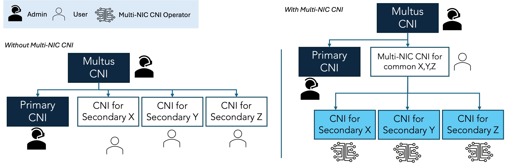

## **official document:** https://foundation-model-stack.github.io/multi-nic-cni

- [Multi-NIC CNI](#multi-nic-cni)
  - [MultiNicNetwork](#multinicnetwork)
  - [Usage](#usage)
      - [Installation](#installation)
        - [Requirements](#requirements)
        - [Quick Installation](#quick-installation)
        - [Deploy MultiNicNetwork resource](#deploy-multinicnetwork-resource)
      - [Test](#test)
- [Demo](#demo)
- [Blog Posts, Talks, and Papers](#blog-posts-talks-and-papers)

# Multi-NIC CNI

Multi-NIC CNI is the CNI plugin for secondary networks operating on top of [Multus CNI](https://github.com/k8snetworkplumbingwg/multus-cni). This CNI offers several key features, outlined below, to help cluster administrators and users simplify the process of enabling high-performance networking.

- I) **Unifying user-managed network definition**: User can manage only one network definition for multiple secondary interfaces with a common CNI main plugin such as ipvlan, macvlan, and sr-iov.The Multi-NIC CNI automatically discovers all available secondary interfaces and handles them as a NIC pool.

  

  With this manner, it can provide the following benefits.

  - **Common NAT-bypassing network solution**: All secondary NICs on each host can be assigned with non-conflict CIDR and non-conflict L3 routing configuration that can omit an overlay networking overhead. Particularyly, the CNI is built-in with L3 IPVLAN solution composing of the following functionalities.
    1) **Interface-host-devision CIDR Computation**: compute allocating CIDR range for each host and each interface from a single global subnet with the number of bits for hosts and for interface. 
    2) **L3 Host Route Configuration**: configure L3 routes (next hop via dev) in host route table according to the computed CIDR.
    3) **Distributed IP Allocation Management**: manage IP allocation/deallocation distributedly via the communication between CNI program and daemon at each host.

    [read more](./document/docs/Concept/multi-nic-ipam.md) 

  - **Policy-based secondary network attachment**: Instead of statically set the desired host's master interface name one by one, user can define a policy on attaching multiple secondary network interfaces such as specifying only the number of desired interfaces, filtering only highspeed NICs. 

    [read more](./document/docs/Concept/policy.md)

-  II) **Bridging device plugin runtime results and CNI configuration:** Multi-NIC CNI can configure CNI of network device in accordance to device plugin allocation results orderly.

   

- III) **Building-in with several auto-configured CNIs**
Leveraging advantage point of managing multiple CNIs together with auto-discovery and dynamic interface selection, we built several auto-configured CNIs in the Multi-NIC CNI project.

  

The Multi-NIC CNI architecture can be found [here](./document/docs/contributing/architecture.md).

## MultiNicNetwork
The Multi-NIC operator operates over a custom resource named *MultiNicNetwork* defined by users.
This definition will define a Pod global subnet, common network definition (main CNI and IPAM plugin), and attachment policy. 
After deploying *MultiNicNetwork*, *NetworkAttachmentDefinition* with the same name will be automatically configured and created respectively.

```yaml
# network.yaml
apiVersion: multinic.fms.io/v1
kind: MultiNicNetwork
metadata:
  name: multi-nic-sample
spec:
  subnet: "192.168.0.0/16"
  ipam: |
    {
      "type": "multi-nic-ipam",
      "hostBlock": 6, 
      "interfaceBlock": 2,
      "vlanMode": "l3"
    }
  multiNICIPAM: true
  plugin:
    cniVersion: "0.3.0"
    type: ipvlan
    args: 
      mode: l3
  attachPolicy:
    strategy: none
```

Argument|Description|Value|Remarks
---|---|---|---
subnet|cluster-wide subnet for all hosts and pods|CIDR range|currently support only v4
hostBlock|number of address bits for host indexing| int (n) | the number of assignable host = 2^n
ipam|ipam plugin config| string | ipam can be single-NIC IPAM (e.g., whereabouts, VPC-native IPAM) or multi-NIC IPAM (e.g., [Multi-NIC IPAM Plugin](./document/docs/Concept/multi-nic-ipam.md#ipam-configuration))
multiNicIPAM| indicator of ipam type | bool | **true** if ipam returns multiple IPs from *masters* key of NetworkAttachmentDefinition config at once, **false** if ipam returns only single IP from static config in ipam block
plugin|main plugin config|[NetConf](https://pkg.go.dev/github.com/containernetworking/cni/pkg/types#NetConf) + plugin-specific arguments | main plugin integration must implement [Plugin](./plugin/plugin.go) with GetConfig function
attachPolicy|attachment policy|policy|[strategy](./document/docs/Concept/policy.md) with corresponding arguments to select host NICs to be master of secondary interfaces on Pod
namespaces| (optional) limit network definition application to list of namespaces (i.e., to create NetworkAttachmentDefinition resource)|[]string|if not specified, network definitions will be applied to all namespaces. new item can be added to the list by `kubectl edit` to create new NetworkAttachmentDefinition. the created NetworkAttachmentDefinition must be deleted manually if needed.


## Usage

### Installation
For full installation guide, please check https://foundation-model-stack.github.io/multi-nic-cni/user_guide/.

#### Requirements
- **Secondary interfaces** attached to worker nodes, check terraform script [here](https://github.com/foundation-model-stack/multi-nic-cni/tree/main/terraform).
    * Secondary interfaces must have an **IPv4** address assigned.
- Multus CNI installation; compatible with networkAttachmentDefinition and pod annotation in **multus-cni v3.8**
- For IPVLAN L3 CNI, the following configurations are additionally required
    * enable allowing **IP spoofing** for each attached interface
    * set **security group** to allow IPs in the target container subnet
    * **IPVLAN support (kernel version >= 4.2)**


#### Quick Installation

- Openshift Container Platform:
  - Search for `multi-nic-cni-operator` in OperatorHub

    


#### Deploy MultiNicNetwork resource
1. Prepare `network.yaml` as shown in the [example](#multinicnetwork)
    
2. Deploy 
   ```bash
   kubectl apply -f network.yaml
   ```
   After deployment, the operator will create *NetworkAttachmentDefinition* of [Multus CNI](https://github.com/k8snetworkplumbingwg/multus-cni) from *MultiNicNetwork* as well as dependent resource such as *SriovNetworkNodePolicy*, *SriovNetwork* for sriov plugin.
3. To attach additional interfaces, annotate the pod with the network name
    ```yaml
    metadata:
      annotations:
        k8s.v1.cni.cncf.io/networks: multi-nic-sample
    ```

### Test
For full user guide and testing , please check https://foundation-model-stack.github.io/multi-nic-cni/user_guide/user.

#### Check simple client-server connection

1. Set target peer
   
    ```bash
    export SERVER_HOST_NAME=<target-server-node-name>
    export CLIENT_HOST_NAME=<target-client-node-name>
    ```
    
    > If the target peer is not set, the last two of listed nodes will be selected as server and client, respectively.

2. Run the test
    ```bash
    make sample-concheck
    ```
    Example output:
    
    ```python
    # pod/multi-nic-iperf3-server created
    # pod/multi-nic-iperf3-server condition met
    # pod/multi-nic-iperf3-client created
    # pod/multi-nic-iperf3-client condition met
    # [  5] local 192.168.0.66 port 46284 connected to 192.168.0.130 port 5201
    # [ ID] Interval           Transfer     Bitrate         Retr  Cwnd
    # [  5]   0.00-1.00   sec   121 MBytes  1.02 Gbits/sec    0   3.04 MBytes
    # [  5]   1.00-2.00   sec   114 MBytes   954 Mbits/sec    0   3.04 MBytes
    # [  5]   2.00-3.00   sec   115 MBytes   964 Mbits/sec   45   2.19 MBytes
    # [  5]   3.00-4.00   sec   114 MBytes   954 Mbits/sec   45   1.67 MBytes
    # [  5]   4.00-5.00   sec   114 MBytes   954 Mbits/sec    0   1.77 MBytes
    # - - - - - - - - - - - - - - - - - - - - - - - - -
    # [ ID] Interval           Transfer     Bitrate         Retr
    # [  5]   0.00-5.00   sec   577 MBytes   969 Mbits/sec   90             sender
    # [  5]   0.00-5.04   sec   574 MBytes   956 Mbits/sec                  receiver

    # iperf Done.
    # pod "multi-nic-iperf3-client" deleted
    # pod "multi-nic-iperf3-server" deleted
    ```

- If pod is failed to start, check [this troubleshooting guide](https://foundation-model-stack.github.io/multi-nic-cni/troubleshooting/troubleshooting/#pod-failed-to-start).
- If pod is failed to communicate, check [this troubleshooting guide](https://foundation-model-stack.github.io/multi-nic-cni/troubleshooting/troubleshooting/#tcpudp-communication-failed).

# Demo

https://github.com/user-attachments/assets/129239b9-37f0-4669-b2ec-d93c4ce16c84

# Blog Posts, Talks, and Papers
Discover more insights about Multi-NIC CNI through our blog posts, talks, and academic papers.

- Medium Blog Post Series: https://medium.com/@sunyanan.choochotkaew1/list/multinic-cni-series-8570830e6f3f
- KubeCon+CloudNativeCon NA 20222 CNCF-Hosted Co-located Event: https://sched.co/1AsSs
- KubeCon+CloudNativeCon NA 20224 CNCF-Hosted Co-located Event: https://sched.co/1izs8
- Multi-NIC CNI in Vela IBM Research's AI supercomputer in the cloud: https://research.ibm.com/blog/openshift-foundation-model-stack
- Paper - The infrastructure powering IBM's Gen AI model development: https://arxiv.org/abs/2407.05467