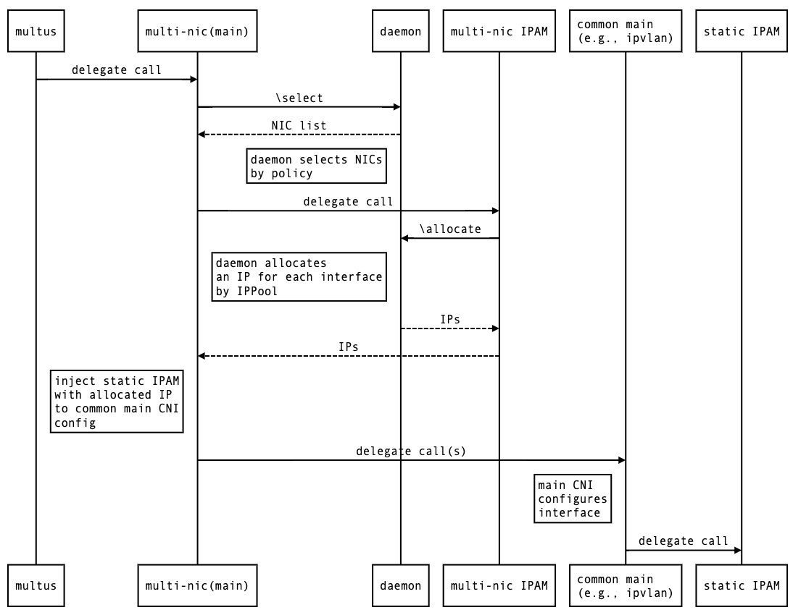
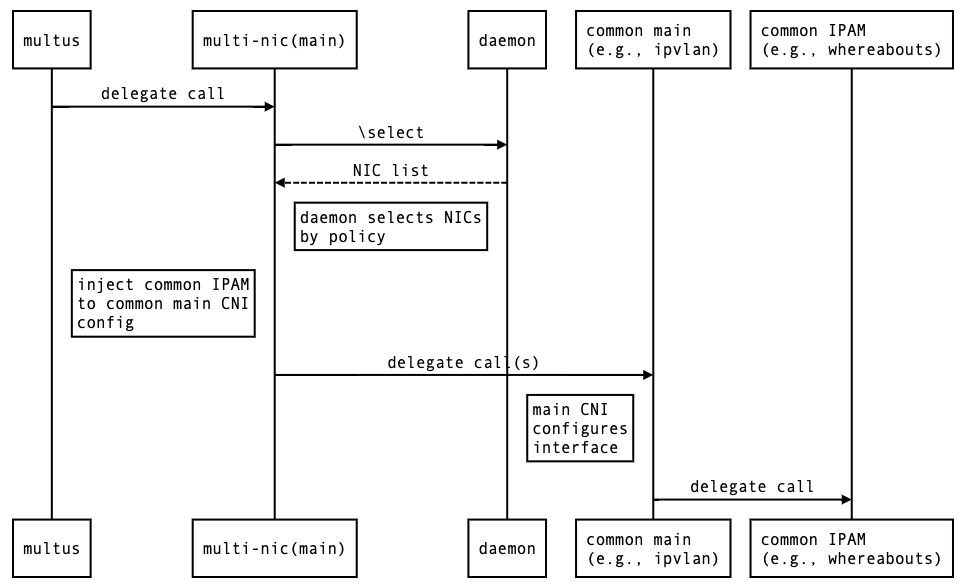

## Multi-NIC CNI Binary

Multi-NIC CNI implements [CNI Plugin framework](https://github.com/containernetworking/cni
) in CNCF project. There are two CNI binary files for [main plugin](./plugins/main/) and [IPAM plugin](./plugins/ipam/). Both plugins communicate with [Multi-NIC CNI Daemon](../daemon/) component for selecting NICs by policy and for allocating and deallocating IP addresses, respectively.

[pkg dependency](./pkg/) is forked from [github.com/containernetworking/plugins](https://github.com/containernetworking/plugins/tree/master/pkg)

### Test and Build CNI
```bash
make build-with-test
```

### Workflow
The main Multi-NIC CNI can work with IPAM for multiple NICs and with IPAM for a single NIC as follows.

#### Multi-NIC CNI with Multi-NIC IPAM


#### Multi-NIC CNI with single-NIC IPAM (e.g., whereabouts)
