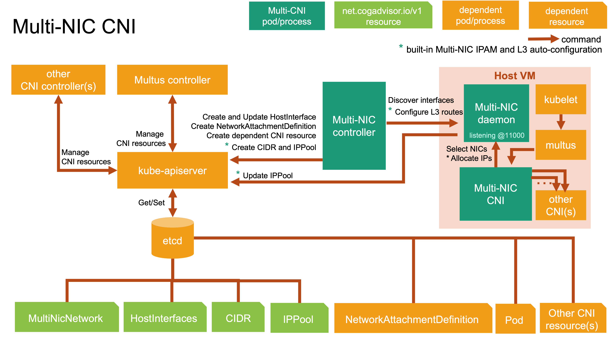

# Architecture

Multi-NIC CNI operator is composed of three main components: controller, daemon, and CNI.
The controller implements Operator SDK to create and run a reconcile loop over the CNI custom resource that is MultiNicNetwork, HostInterfaces, CIDR, and IPPool via kube-apiserver.

The controller periodically gets interface information from host networks by calling discovery protocol to the daemon and records in *HostInterface* resource. 

The controller creates Multus's *NetworkAttachmentDefinition* and dependent custom resources of main plugin CNI (e.g., sriovnetworknodepolicies of SR-IOV CNI) from *MultiNicNetwork*'s spec. 

The generation of *CIDR* and *IPPool*, L3 route configuration, and IP allocation/deallocation can be found in [Multi-NIC IPAM Plugin](multi-nic-ipam.md).

The CNI component is delegated by Multus CNI. It communicates with daemon to select a set of master interfaces according to the policy if defined. If the built-in IPAM is used, it will request for IPs regarding these selected masters. Otherwise, it will delegate the common IPAM plugin to get IP address for each selected NIC. 

After getting IP addresses, it will delegate the common main plugin (e.g., ipvlan, macvlan, sriov) to configure each additional interface. 

> Note: In addition to CNI-related resource, controller also run a reconcile loop over the Config custom resource to manage daemon and CNI components