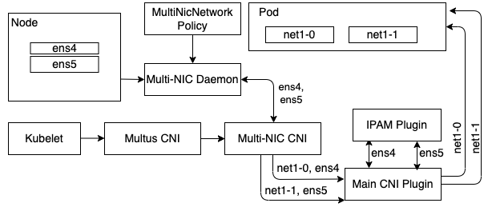

# Multi-Cloud Support

The key benefit of Multi-NIC CNI is that it configures multiple network devices for secondary network solutions on a single CNI call from Kubelet which is delegated by Multus. As a result, Multi-NIC CNI has an extensibility to assign IP address based on both static and dynamic network device selection. 

We separate secondary network solutions on Cloud into three categories based on the network device selection methods: (i) static selection, (ii) dynamic selection performed by Multi-NIC daemon, and (iii) dynamic selection provided by device plugins such as Mellanox OFED device plugin in [NVIDIA network operator](https://docs.nvidia.com/networking/display/COKAN10/Network+Operator). 

## Multi-NIC CNI with static network devices

By default, Multi-NIC CNI will have Multi-NIC daemon select a set of network devices based on user-defined [strategy](./policy.md) (MultiNicNetwork Policy). Then, it will generate a new CNI config per each selected device based on user-defined multi-NIC main and IPAM configurations. IPAM can be either multi-nic-ipam or supported single-NIC IPAM such as whereabouts. The generated config is composed of single-NIC main and single-NIC IPAM configurations.

If no strategy is set, Multi-NIC CNI will automatically select all devices in the master network list specified by `.spec.masterNets` in MultiNicNetwork CR. If the master network list is not set by user, it will be automatically filled by the operator with all available network devices. 

## Multi-NIC CNI with network devices dynamically selected by Multi-NIC daemon

If selection policy is set, the Multi-NIC daemon will apply dynamically and return a list of selected list to the CNI. For example, if the pod is annotated with `cni-args.nics=2`, only two NICs those are available on the nodes will be selected. 

In addition to as-is main CNI (ipvlan and macvlan), we implement a new main CNI for AWS support called `aws-ipvlan`. `aws-ipvlan` connects to EC2 backend to assign and unassign a private IP addresses on ENA network device. `aws-ipvlan` is available from `v1.1.0`. The following table shows the current supported deployment scenarios and corresponding configurations using default network device selection by Multi-NIC daemon (for both static and dynamic).

Scenario|Multi-NIC main|IPAM|(generated) Single-NIC main|(generated) Single-NIC IPAM
---|---|---|---|---
On-premise with L2|ipvlan (L2), macvlan|whereabouts|ipvlan (L2), macvlan|whereabouts
|ipvlan (L2), macvlan|multi-nic-ipam|ipvlan (L2), macvlan|static
VPC with L3 (IBM Cloud, Azure)|ipvlan (L3)|multi-nic-ipam|ipvlan (L3)|static
AWS |aws-ipvlan|multi-nic-ipam|ipvlan (L2), macvlan|static

## Multi-NIC CNI with network devices dynamically provided by device plugin

If network devices are previously allocated by the device plugin such as SR-IoV or RDMA shared device plugin according to the network operator policy (NetworkPolicy), the Multi-NIC daemon will be aware of that by the resource annotation `k8s.v1.cni.cncf.io/resourceName` when perform selection. 

There are two supported single-NIC main CNI those are `sriov` and `host-device`. `sriov` plugin is used as-is. For `host-device`, we further implement `mellanox` for main CNI for extensible supports of NVIDIA network operator and `host-device-ipam` for IPAM to assign the host IP address to the pod device. The following table shows the current supported deployment scenarios and corresponding configurations which depend on network resource allocation from the device plugin. `mellanox` and `host-device-ipam` are available from `v1.2.0`.

Scenario|Multi-NIC main|IPAM|(generated) Single-NIC main|(generated) Single-NIC IPAM
---|---|---|---|---
On-premise with SR-IoV|sriov|whereabouts|sriov|whereabouts
|sriov|multi-nic-ipam|sriov|static
On-premise with Mellanox OFED|mellanox|whereabouts|host-device|whereabouts
|mellanox|host-device-ipam|host-device|static
VPC with Mellanox OFED|mellanox|host-device-ipam|host-device|static

## Hybrid secondary network solution
Multi-NIC CNI also allows the cluster to have more than one MultiNicNetwork defintitions. For example, the node can define a set of dedicated network devices limited by `pciAddresses` in [NICClusterPolicy](https://github.com/Mellanox/network-operator#nicclusterpolicy-crd) for full ability of GDR with `mellanox` main plugin. At the same time, the node can have another set of network devices limited by `masterNets` in [MultiNicNetwork](policy.md#none-strategy-none) to be shared between pods without GDR need using `ipvlan` main plugin.

