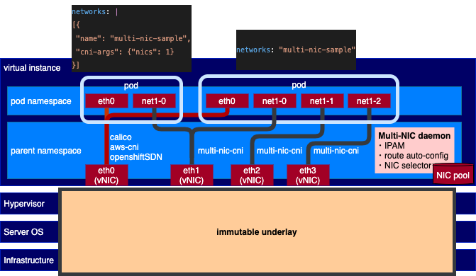

# Multi-NIC CNI

Multi-NIC CNI is an open source project implementing CNI plugin and operating on top of [Multus CNI](https://github.com/k8snetworkplumbingwg/multus-cni). However, unlike Multus, instead of defining and handling each secondary network interface one by one, this CNI automatically discovers all available secondary interfaces and handles them as a NIC pool.

