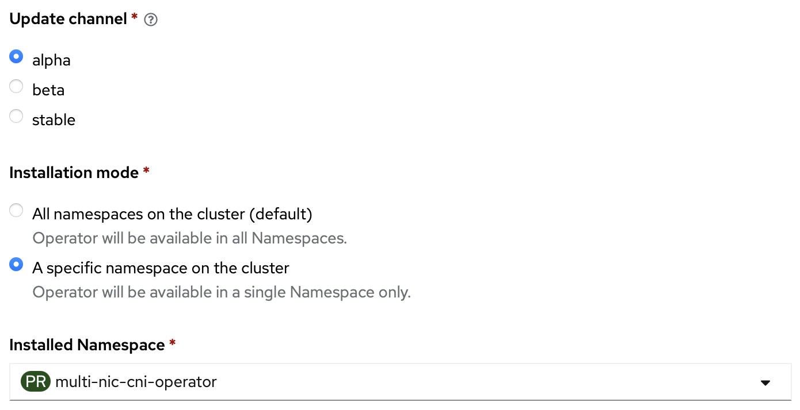

# Alpha Channel

## v1.2.8

**Feature**

- Use owner reference to remove NAD upon removal
- Use RetryOnConflict for finalizer removal

**Maintenance**

- code
    * increase test coverage to 70.7%
    * upgrade controller go version 1.24.1 with up-to-date dependency

- documentation
    * add bare metal infra configuration
    * update infra preparation for aws and ibmcloud

- operation
    * kbuilder workflow
    * hotfix issue template

**Fix**

- correct interface name on host-device ADD and prevent tabu prefix
- fix PSP security settings for connection check

## v1.2.7

- support macvlan plugin

- code enhancements:
    * refactor code structure (add internal packages)
    * upgrade test to ginkgo V2
    * generate measurable test coverage results
    * improve test coverage to 60%

- fixes:
    * correct sample multinicnetwork for macvlan+whereabouts IPAM
    * handle error from ghw.PCI call

## v1.3.0 (based on v1.2.2)

This version does not include the bug fix for incompability to newer version of network operator in https://github.com/foundation-model-stack/multi-nic-cni/pull/182.

**Improvements:**

* Make all fields except interfaceName in `HostInterface.Interfaces` optional
* Add **namespace watcher** to add `NetworkAttachmentDefinition` when new namespace is created
* Set `manager` container as default container in controller

## v1.2.2 (deprecated)

This version does not include the bug fix for incompability to newer version of network operator in https://github.com/foundation-model-stack/multi-nic-cni/pull/182.

**Improvements:**

* Multi-config IPAM (`multi-config`) 

        ipam: |
            { 
            "type": "multi-config",
            "ipam_type": "whereabouts",
            "args": {
                    "eth1": {
                        "range": "192.168.0.0/18"
                    },
                    "eth2": {
                        "range": "192.168.64.0/18"
                    }
                }
            }
        
* Static IP support

        annotations:
                k8s.v1.cni.cncf.io/networks: |
                    [{
                            "name": "multinic-network",
                            "cni-args": {
                            "masters": ["eth1", "eth2"]
                            },
                            "ips": [ "192.168.0.1/18", "192.168.64.1/18" ]
                    }]

## v1.2.1 (deprecated)

This version does not include the bug fix for incompability to newer version of network operator in https://github.com/foundation-model-stack/multi-nic-cni/pull/182.

**Improvements:**

* Unmanaged HostNetworkInterface for IP-less network device 
    - zero host block/zero interface block

            apiVersion: multinic.fms.io/v1
            kind: MultiNicNetwork
            metadata:
                name: multinic-unmanaged
            spec:
                ipam: |
                    {
                    "type": "multi-nic-ipam",
                    "hostBlock": 0, 
                    "interfaceBlock": 0,
                    "vlanMode": "l2"
                    }
                multiNICIPAM: true
                plugin:
                    cniVersion: "0.3.0"
                    type: ipvlan
                    args: 
                        mode: l2

    - specify static cidr of each host

            apiVersion: multinic.fms.io/v1
            kind: HostInterface
            metadata:
                name: node-1
                labels:
                  multi-nic-unmanaged: "true"
            spec:
                hostName: node-1
                interfaces:
                -   hostIP: ""
                    interfaceName: eth1
                    netAddress: 192.168.0.0/24
                    pciAddress: ""
                    product: ""
                    vendor: ""
                -   hostIP: ""
                    interfaceName: eth2
                    netAddress: 192.168.1.0/24
                    pciAddress: ""
                    product: ""
                    vendor: ""
                
* Multi-gateway route configuration support

        apiVersion: multinic.fms.io/v1
        kind: MultiNicNetwork
        metadata:
            name: multinic-multi-gateway
        spec:
            ipam: |
                {
                "type": "multi-nic-ipam",
                ...
                "routes": [{"dst": "10.0.0.0/24","gw": "1.1.1.1"}, {"dst": "10.0.0.0/24","gw": "2.2.2.2"}]
                }
            multiNICIPAM: true

    The above definition will generate the following route on pod:
    
    `10.0.0.0/24 nexthop via 1.1.1.1 nexthop via 2.2.2.2`