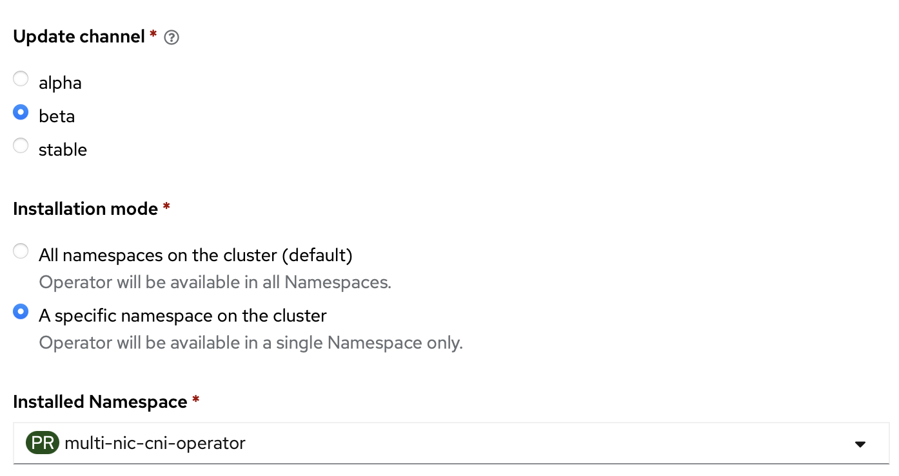

# Beta Channel

## v1.2.6

- upgrade go version
  * controller: GO 1.22
  * daemon, CNI: GO 1.23
- remove kube-rbac-proxy
- add make `set_version` target to simplify release steps
- update concept image, user and contributing guide
- rewrite the highlighted features and add demo and references
- fix bugs: 
    * [sample-concheck make error](https://github.com/foundation-model-stack/multi-nic-cni/pull/235)
    * [failed to load netconf: post fail: Post "http://localhost:11000/select": EOF](https://github.com/foundation-model-stack/multi-nic-cni/issues/240)

## v1.2.0 (deprecated)

**Major feature update:**

* [Topology-aware NIC Selection](../concept/policy.md#topology-strategy)
* RoCE GDR-support CNI (NVIDIA MOFED operator) - `mellanox`
    - Host-device CNI support
    - NICClusterPolicy aware

            apiVersion: multinic.fms.io/v1
            kind: MultiNicNetwork
            metadata:
            name: multinic-mellanox-hostdevice
            spec:
                ipam: |
                    {
                        "type": "host-device-ipam"
                    }
                multiNICIPAM: false
                plugin:
                    cniVersion: "0.3.1"
                    type: mellanox

---

## v1.1.0 (deprecated)

**Major feature update:**

[Multi-cloud support](../user_guide/index.md#additional-multinicnetwork-for-specific-cloud-infrastructure)

- AWS-support CNI
    - Provide `aws-ipvlan` working with Multi-NIC IPAM
    - Support using Host subnet for Pod subnet for ENA

            apiVersion: multinic.fms.io/v1
            kind: MultiNicNetwork
            metadata:
            name: multinic-aws-ipvlan
            spec:
                ipam: |
                    {
                    "type": "multi-nic-ipam",
                    "hostBlock": 8, 
                    "interfaceBlock": 2,
                    "vlanMode": "l2"
                    }
                multiNICIPAM: true
                plugin:
                    cniVersion: "0.3.0"
                    type: aws-ipvlan
                    args: 
                    mode: l2
