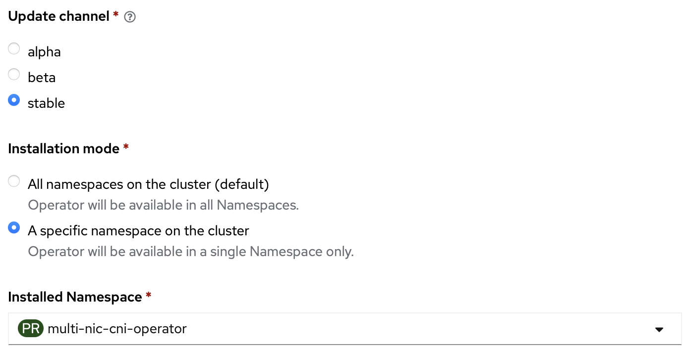

# Stable Channel (default)

## v1.2.5

- support multiple resource names defined in NicClusterPolicy for Mellanox Host Device use case
- remove unnecessary selection policy call when network devices have already selected by the device plugin

## v1.2.4

**Major feature update:**
- The following attributes of HostInterface is changed to optional.

        NetAddress    string `json:"netAddress,omitempty"`
        HostIP        string `json:"hostIP,omitempty"`
        Vendor        string `json:"vendor,omitempty"`
        Product       string `json:"product,omitempty"`
        PciAddress    string `json:"pciAddress,omitempty"`

- Set default container of controller pod to `manager`.
- Namespace watcher to watch newly-created namespace and create a NetworkAttachmentDefinition of the existing MultiNicNetwork.

**Fixes**
- `LastSyncTime` is nil. 
- Invalid resource name with prefix.

see: https://github.com/foundation-model-stack/multi-nic-cni/pull/182

## v1.0.5

**Improvements:**

* allow own namespace and single namespace
  
**Bug fixes**

* unavailability of unrelated subnet [Issue #117](https://github.com/foundation-model-stack/multi-nic-cni/issues/117)
* try getting daemon pod if cache not found when calling interface update [Issue #118](https://github.com/foundation-model-stack/multi-nic-cni/issues/118)
* continue after net-attach-def create/udpate error in [PR #114](https://github.com/foundation-model-stack/multi-nic-cni/pull/114)

---

## v1.0.4 (deprecated)

**CRD changes:**

* config:
    * add following dynamic config values
    
            // type ConfigSpec struct
            UrgentReconcileSeconds int        `json:"urgentReconcileSeconds,omitempty"`
            NormalReconcileMinutes int        `json:"normalReconcileMinutes,omitempty"`
            LongReconcileMinutes   int        `json:"longReconcileMinutes,omitempty"`
            ContextTimeoutMinutes  int        `json:"contextTimeoutMinutes,omitempty"`
            LogLevel               int        `json:"logLevel,omitempty"`

**Improvements:**

* apply linter code analysis removing unused function, handling errors
* allow changing reconciler time and log level on the fly from config.multinic
* change file strcuture
    * separate unit-test folder
    * move constatnt and shared varaible to vars package
* allow changing synchronization ticker period (TickerIntervalKey) and maximum size of daemon pod watching queue (MAX_QSIZE) from environment variable 
* change logger time encoder to ISO 8601
* support OwnNamespace/SingleNamespace namespace deployment
  
**Bug fixes:**

* computeResult is reset at one point after CIDR update with no change
* potentially hang at scale due to API server never return for large amount of listing
* continue creating NetworkAttachmentDefinition even if it is failed to create/update NetworkAttachmentDefinition in some namespaces

---

## v1.0.3 (deprecated)

**CRD changes:**

* cidrs: 
    * add corresponding IPPool to CIDR spec (`spec.cidr.hosts[*].ippool`)
* multinicnetwork: 
    * add host discovery and processing progress (`status.discovery`)
    * add network config status (`status.configStatus`)
* config:
    * add toleration spec for e2e integration test and future taint usecases (`spec.daemon.tolerations`)
  
**Improvements:**

* separate log level on controller manager

    Verbose Level | Information
    ---|---
    1|- critical error (cannot create/update resource by k8s API)   - "Set Config" key   - set up log  - config error
    2|- significant events/failures of multinicnetwork
    3|- significant events/failures of cidr
    4 (default)|- significant events/failures of hostinterface
    5|- significant events/failures of ippools
    6|- significant events/failures of route configurations 
    7|- requeue   - get deleted resource   - debug pointers (e.g., start point of function call)

* log CNI message on host
    * main plugin: `/var/log/multi-nic-cni.log`
    * IPAM plugin: `/var/log/multi-nic-ipam.log`
* add CI tests
    * multi-nicd test (daemon and CNI components)
    * end-to-end 200-node scale test on kind cluster using kwok 
  
**Bug fixes:**

* sequential CIDR update blocking in scale (scale issue)
* unexpected HostInterface deletion when API server is stressed (scale issue)
* unexpected interface updates on HostInterface when API server is stressed (scale issue)
* missing HostInterface at initialization (fault-tolerance issue)

---

## v1.0.2 (deprecated)

- First release (as open source)

**Core Features:**

* Host-interface auto-discovery
* Single definition for multiple secondary network attachments
* Multi-NIC IPAM (CIDR computation, IP allocation/deallocation) for multiple secondary subnets
* L3 configurations on host neighbour route table corresponding to ipvlan CNI plugin with l3 mode

**Supplementary Features:**

* NIC selection based on specific requested number or specific interface name list
* Dynamic CIDR updates when
    * detecting added/removed hosts at creation/deletion of multi-nic daemon
    * (periodically) discovering added/removed secondary interfaces
* Fault tolerance in scale (tested upto 100 nodes x 2 secondary interfaces) with
    * initial synchronization of CIDR, IPPool after controller restarted
    * periodic synchronization of L3 routes for hosts which were restarted and lost the configuration
