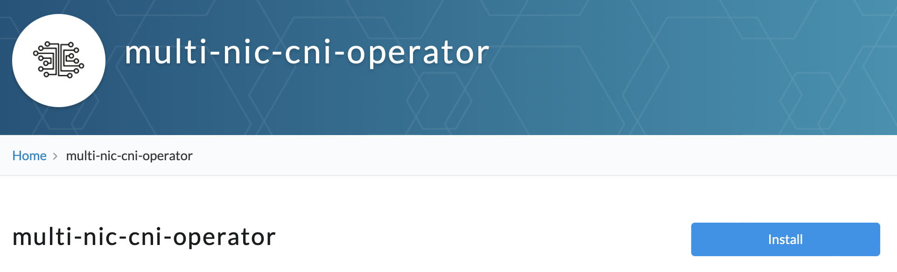
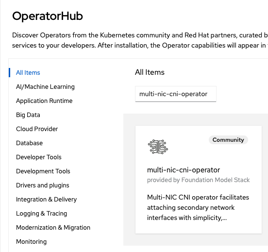
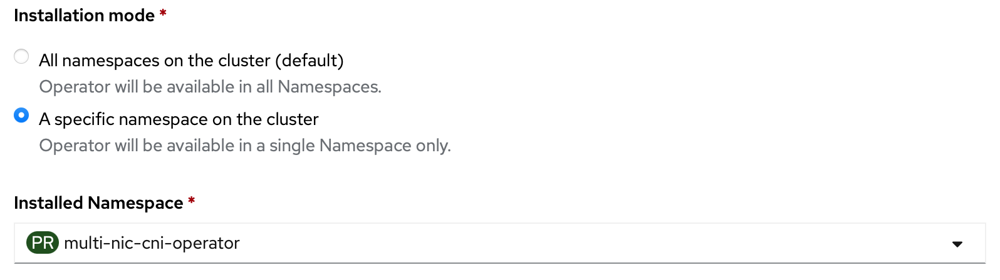

# Installation
## Requirements
- Secondary interfaces attached to worker nodes, check terraform script [here](https://github.com/foundation-model-stack/multi-nic-cni/tree/main/terraform).
    * Secondary interfaces must have an **IPv4** address assigned.
- Multus CNI installation; compatible with networkAttachmentDefinition and pod annotation in multus-cni v3.8
- For IPVLAN L3 CNI, the following configurations are additionally required
    * enable allowing IP spoofing for each attached interface
    * set security group to allow IPs in the target container subnet
    * IPVLAN support (kernel version >= 4.2)
## 1. Install Operator
**by OperatorHub**

- Kubernetes with OLM:
    * check [multi-nic-cni-operator on OperatorHub.io](https://operatorhub.io/operator/multi-nic-cni-operator)
    
- Openshift Container Platform:
    * Search for `multi-nic-cni-operator` in OperatorHub
    

Recommended to deploy in the same default namespace for [health check service](https://operatorhub.io/operator/multi-nic-cni-operator/health-check), which is `multi-nic-cni-operator`. 



(available version >= v1.0.5)

**by manifests with kubectl**

```bash
kubectl apply -f deploy/
```
**by bundle with operator-sdk**

```bash
operator-sdk run bundle ghcr.io/foundation-model-stack/multi-nic-cni-bundle:v1.0.5 -n multi-nic-cni-operator
```

## 2. Check if Cluster is Ready

1. Controller and multi-nicd daemon pods are running annd hostinterface are created.

        > kubectl get po -n multi-nic-cni-operator
        NAME                                                         READY   STATUS    RESTARTS   AGE
        multi-nic-cni-operator-controller-manager-6cbf4d57f9-zxx89   1/1     Running   0          40h
        multi-nicd-bgrvq                                             1/1     Running   0          40h
        multi-nicd-c4hdv                                             1/1     Running   0          40h
        multi-nicd-f2gkk                                             1/1     Running   0          40h
        ...

        > kubectl get hostinterfaces
        NAME                                   AGE
        worker-node-1                          40h
        worker-node-2                          40h
        worker-node-3                          40h

    If multi-nicd is not running or hostinterface is not created, check [this troubleshooting guide](../troubleshooting/troubleshooting.md#hostinterface-not-created).


3. Secondary interfaces have been correctly detected. 

        # Please replace the host interface with your worker name.
        > kubectl get hostinterface worker-node-1 -oyaml
        apiVersion: multinic.fms.io/v1
        kind: HostInterface
        metadata:
          name: worker-node-1
          ...
        spec:
          hostName: worker-node-1
          interfaces:
          - hostIP: 10.0.1.0
            interfaceName: eth1
            ...

      If secondary interface is not added, check [this troubleshooting guide](../troubleshooting/troubleshooting.md#no-secondary-interfaces-in-hostinterface).

## 3. Deploy MultiNicNetwork resource

### Common MultiNicNetwork

The following [MultiNicNetwork](#deploy-multinicnetwork-resource) is available for any Cloud infrastructure which meets [the requirements](#requirements).

**MultiNicNetwork CR**

```yaml
# network.yaml
apiVersion: multinic.fms.io/v1
kind: MultiNicNetwork
metadata:
  name: multi-nic-sample
spec:
  subnet: "192.168.0.0/16"
  ipam: |
    {
      "type": "multi-nic-ipam",
      "hostBlock": 6, 
      "interfaceBlock": 2,
      "vlanMode": "l3"
    }
  multiNICIPAM: true
  plugin:
    cniVersion: "0.3.0"
    type: ipvlan
    args: 
      mode: l3
  attachPolicy:
    strategy: none
  namespaces:
  - default
```

Argument|Description|Value|Remarks
---|---|---|---
subnet|cluster-wide subnet for all hosts and pods|CIDR range|currently support only v4
hostBlock|number of address bits for host indexing| int (n) | the number of assignable host = 2^n
ipam|ipam plugin config| string | ipam can be single-NIC IPAM (e.g., whereabouts, VPC-native IPAM) or multi-NIC IPAM (e.g., [Multi-NIC IPAM Plugin](../concept/multi-nic-ipam.md#ipam-configuration))
multiNicIPAM| indicator of ipam type | bool | **true** if ipam returns multiple IPs from *masters* key of NetworkAttachmentDefinition config at once, **false** if ipam returns only single IP from static config in ipam block
plugin|main plugin config|[NetConf](https://pkg.go.dev/github.com/containernetworking/cni/pkg/types#NetConf) + plugin-specific arguments | main plugin integration must implement [Plugin](https://github.com/foundation-model-stack/multi-nic-cni/blob/main/plugin/plugin.go) with GetConfig function
attachPolicy|attachment policy|policy|[strategy](../concept/policy.md) with corresponding arguments to select host NICs to be master of secondary interfaces on Pod
namespaces|list of namespaces to apply the network definitions (i.e., to create NetworkAttachmentDefinition resource)|[]string|apply to all namespace if not specified. new item can be added to the list by `kubectl edit` to create new NetworkAttachmentDefinition. the created NetworkAttachmentDefinition must be deleted manually if needed.

1. Prepare `network.yaml` as shown in the [example](#multinicnetwork)
    
2. Deploy the network definition.

        kubectl apply -f network.yaml

    After deployment, the operator will create *NetworkAttachmentDefinition* of [Multus CNI](https://github.com/k8snetworkplumbingwg/multus-cni) from *MultiNicNetwork* as well as dependent resource such as *SriovNetworkNodePolicy*, *SriovNetwork* for sriov plugin.


### Additional MultiNicNetwork for specific Cloud infrastructure

In addition to [the common MultiNicNetwork with IPVLAN-L3](#common-multinicnetwork), `Multi-NIC CNI` offers unique benefits tailored to each specific cloud infrastructure from v1.1.0, as shown below. Corresponding network options (MultiNicNetwork) for each infrastructure are listed accordingly.

Please check latest [release](../release/index.md).

Multi-NIC CNI Features|IBM Cloud|Bare Metal|AWS|Azure (tentative)
---|---|---|---|---
Single definition for multiple attachments<br>- dynamic interface discovery<br>- policy-based NIC selection|&check;|&check;|&check;|&check;
CIDR/IP management|&check;|*|*|&check;
L3 Route configuration|&check;|X|X|&check;

> **&check;:** beneficial<br>**\*:** optional (e.g., replacable by whereabout, aws-vpc-cni IPAM)<br>**X:** non-beneficial as using L2

### IBM Cloud, Azure

- [IPVLAN L3](https://github.com/foundation-model-stack/multi-nic-cni/tree/main/config/samples/multinicnetwork/ipvlanl3.yaml)

        kubectl apply -f config/samples/multinicnetwork/ipvlanl3.yaml

- [Mellanox Host Device with Host Device IPAM](https://github.com/foundation-model-stack/multi-nic-cni/tree/main/config/samples/multinicnetwork/mellanox_hostdevice.yaml)

        kubectl apply -f config/samples/multinicnetwork/mellanox_hostdevice.yaml

        
### BareMetal
- [MACVLAN with whereabout IPAM](https://github.com/foundation-model-stack/multi-nic-cni/tree/main/config/samples/multinicnetwork/macvlan.yaml)

        kubectl apply -f config/samples/multinicnetwork/macvlan.yaml

- [MACVLAN with Multi-NIC IPAM](https://github.com/foundation-model-stack/multi-nic-cni/tree/main/config/samples/multinicnetwork/macvlan_ipam.yaml)

        kubectl apply -f config/samples/multinicnetwork/macvlan_ipam.yaml

- [IPVLAN L2 with whereabout IPAM](https://github.com/foundation-model-stack/multi-nic-cni/tree/main/config/samples/multinicnetwork/ipvlanl2.yaml)

        kubectl apply -f config/samples/multinicnetwork/ipvlanl2.yaml

- [SR-IoV with Multi-NIC IPAM](https://github.com/foundation-model-stack/multi-nic-cni/tree/main/config/samples/multinicnetwork/sriov.yaml)

        kubectl apply -f config/samples/multinicnetwork/sriov.yaml

- [Mellanox Host Device with Host Device IPAM](https://github.com/foundation-model-stack/multi-nic-cni/tree/main/config/samples/multinicnetwork/mellanox_hostdevice.yaml)

        kubectl apply -f config/samples/multinicnetwork/mellanox_hostdevice.yaml

### AWS
- [IPVLAN L2 with AWS-VPC-connecting IPAM](https://github.com/foundation-model-stack/multi-nic-cni/tree/main/config/samples/multinicnetwork/awsipvlan.yaml)

        kubectl apply -f config/samples/multinicnetwork/awsipvlan.yaml

## 4. Check if MultiNicNetwork is Ready

Get multinicnetwork's status:

```bash
> kubectl get multinicnetwork -oyaml
- apiVersion: multinic.fms.io/v1
  kind: MultiNicNetwork
  metadata:
    ...
    name: multi-nic-cni-operator-ipvlanl3
  spec:
    ...
  status:
    computeResults:
    - netAddress: 10.241.130.0/24
      numOfHosts: 3
    configStatus: Success
    discovery:
      cidrProcessed: 3
      existDaemon: 3
      infoAvailable: 3
    lastSyncTime: "2025-03-05T23:49:48Z"
    message: ""
    routeStatus: Success
```

- The `configStatus` should be "Success". 
- `discovery` should show the number of available interfaces `infoAvailable`. 
- If `multi-nic-ipam` is specified in spec, `computeResults` should be added. 
- If `L3` mode is used with IPVLAN, `routeStatus` should be "Success". 

## 5. Check Connection

### By Script
see [check connection](./user.md#check-connections).

### By Health Checker Service

Deploy health check and agents to the cluster to serve a functional and connetion checking on-demand and periodically exporting to Prometheus metric server. See [more detail](https://github.com/foundation-model-stack/multi-nic-cni/tree/main/health-check).

## Clean up
**installed by manifests with kubectl**
```
kubectl delete -f deploy/
```
**installed by bundle with operator-sdk**
```
operator-sdk cleanup multi-nic-cni-operator -n multi-nic-cni-operator
```
