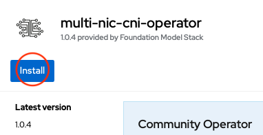
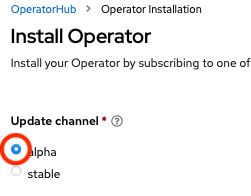
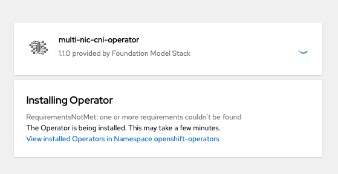

# Multi-NIC CNI on Multi-Cloud

Multi-NIC CNI Features|IBM Cloud|Bare Metal|AWS|Azure (tentative)
---|---|---|---|---
Single definition for multiple attachments - dynamic interface discovery - policy-based NIC selection|&check;|&check;|&check;|&check;
CIDR/IP management|&check;|*|*|&check;
L3 Route configuration|&check;|X|X|&check;

> **&check;:** beneficial **\*:** optional (e.g., replacable by whereabout, aws-vpc-cni IPAM) **X:** non-beneficial as using L2

## Operator Installation
Currently, Multi-NIC CNI Operator v1.1.0 for supporting multi-cloud is under developing. The pre-release bundle is available on alpha channel on Openshift OKD OperatorHub.

## MultiNICNetwork Deployment

### IBM Cloud, Azure

- [IPVLAN L3](https://github.com/foundation-model-stack/multi-nic-cni/tree/main/config/samples/multinicnetwork/ipvlanl3.yaml)

        kubectl apply -f config/samples/multinicnetwork/ipvlanl3.yaml
        
### BareMetal
- [IPVLAN L2 with whereabout IPAM](https://github.com/foundation-model-stack/multi-nic-cni/tree/main/config/samples/multinicnetwork/ipvlanl2.yaml)

        kubectl apply -f config/samples/multinicnetwork/ipvlanl2.yaml

- [SR-IoV with Multi-NIC IPAM](https://github.com/foundation-model-stack/multi-nic-cni/tree/main/config/samples/multinicnetwork/sriov.yaml)

        kubectl apply -f config/samples/multinicnetwork/sriov.yaml

### AWS
- [IPVLAN L2 with AWS-VPC-connecting IPAM](https://github.com/foundation-model-stack/multi-nic-cni/tree/main/config/samples/multinicnetwork/awsipvlan.yaml)

        kubectl apply -f config/samples/multinicnetwork/awsipvlan.yaml

## Connection Check
see [check connection](https://github.com/foundation-model-stack/multi-nic-cni/tree/main/README.md#check-connections).