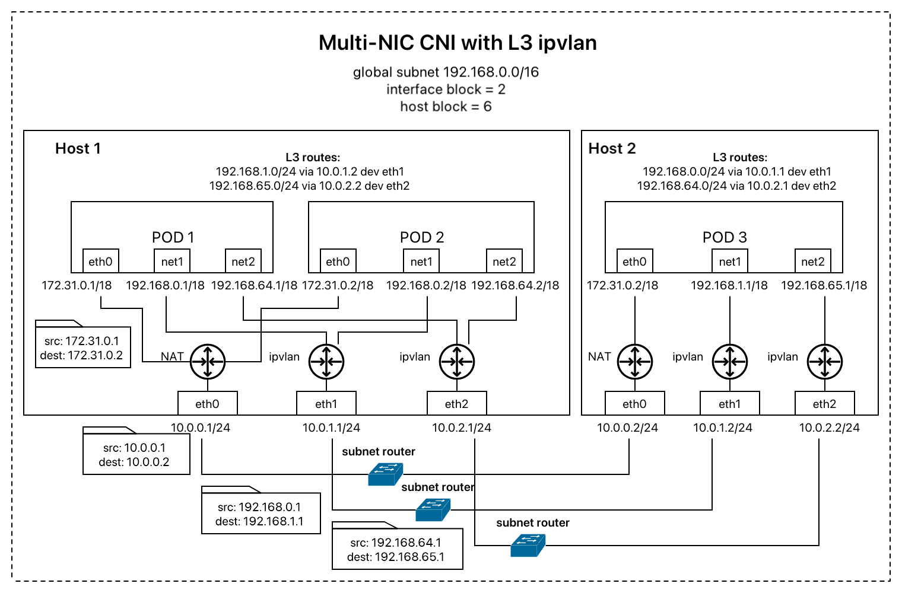
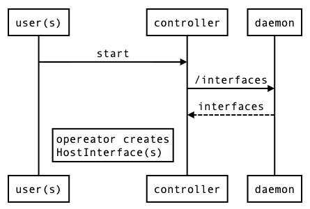
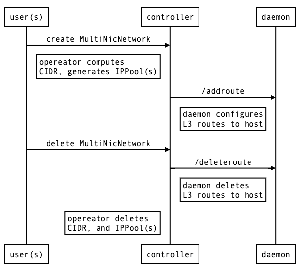
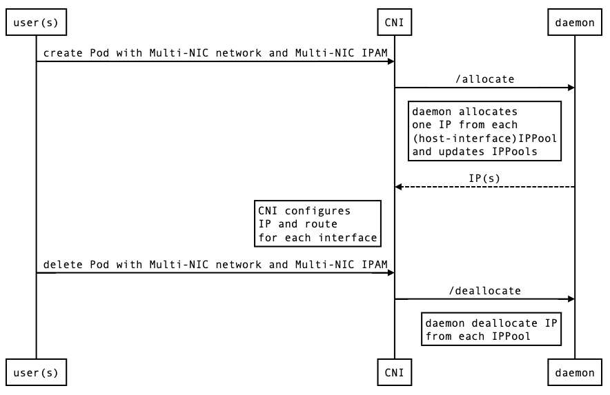

<!-- TOC -->

- [Common NAT-bypassing network solution without underlay infrastructure dependency: L3 IPVLAN with neighbor routing entries](#common-nat-bypassing-network-solution-without-underlay-infrastructure-dependency-l3-ipvlan-with-neighbor-routing-entries)
  - [Multi-NIC CNI Components](#multi-nic-cni-components)
  - [VPC Cluster Requirements](#vpc-cluster-requirements)
  - [IPAM Configuration](#ipam-configuration)
  - [Workflows](#workflows)
    - [Interface Discovery](#interface-discovery)
    - [CIDR Generation and L3 Route Auto-configuration / Clean up](#cidr-generation-and-l3-route-auto-configuration--clean-up)
      - [CIDR Generation](#cidr-generation)
      - [L3 Route Auto-configuration](#l3-route-auto-configuration)
    - [IP Allocation / Deallocation](#ip-allocation--deallocation)

<!-- /TOC -->
# Common NAT-bypassing network solution without underlay infrastructure dependency: L3 IPVLAN with neighbor routing entries
The target is to attach secondary network interface cards at hosts to the container pods and bypass the costly network address translation to efficiently deliver network packets between pods on different hosts. 



IPVLAN is a software multiplexing tool that exposes Pod packet and Pod IP directly to master interface (NIC) on the host. In most cases, Pod IPs are not routable by the underlay virtual Cloud infrastructure. Configuring a neighbor route entry (L3 routes) on the host will enable communication between endpoints on the different hosts.

Multi-NIC CNI computes a specific CIDR range for each interface and each host  incrementally from the user-defined global subnet limiting by defined block sizes. 

In the above example, as the global subnet is 192.168.0.0/16 with 2 interface bits and 6 host bits, the IP addresses assigned to the first master interface (eth1) will start with 192.168.0.x - 192.168.63.x while that assigned to the second one (eth2) will start with 192.168.64.x - 192.168.127.x. 

The IP addresses assigned to the first master interface in the first host are further specified to the range 192.168.1.0 - 192.168.1.255. The first and the last addresses are reserved for network address and broadcast address to be managed later.

With this blocking range of IP, the L3 routes on each host and interface can be configured without conflict.


## Multi-NIC CNI Components
The built-in Multi-NIC IPAM and L3 route auto-configuration performs by collaboration of the controller with [Multi-NIC CNI](../cni/) and [Multi-NIC daemon](../daemon/). 

The CNI uses orchrestrator storage to keep data synchronize by defining new three custom resources: 
```bash
NAME             APIVERSION                                    NAMESPACED   KIND
cidrs            net.cogadvisor.io/v1                          false        CIDR
hostinterfaces   net.cogadvisor.io/v1                          false        HostInterface
ippools          net.cogadvisor.io/v1                          false        IPPool
```
- **CIDR** for recording the computed CIDRs. This resource is created or updated when
  - *MultiNicNetwork* is created or updated with IPAM type `multi-nic-ipam`. 
  - *HostInterface* is updated
- **HostInterface** for keeping discoveried host interface data. This resource is updated if there is a change of host interfaces checked every minute.
- **IPPool** for managing IP allocation/deallocation. This resource is created or updated at the same time when CIDR is created or updated.
  
## VPC Cluster Requirements
- main plugin support (e.g., kernel version >= 4.2 for ipvlan)

For L3 mode,
- enable allowing IP spoofing for each attached interface
- security group
  - allow target global subnet on secondary subnets
  - allow daemon port (default: 11000) on primary subnet

## IPAM Configuration
In addition to global *subnet* and designated *masterNets*, Multi-NIC IPAM requires the following arguments to compute CIDR for each host and each interface.
Argument|Description|Value|Remarks
---|---|---|---
vlanMode|mode for creating ipvlan|l2, l3, l3s|For ls3 and l3s mode, the cni will automatically create corresponding host routes in level 3
hostBlock|number of address bits for host indexing| int (n) | the number of assignable host = 2^n
interfaceBlock|number of address bits for interface indexing| int (m) | the number of assignable interfaces = 2^m
excludeCIDRs|list of ip range (CIDR) to exclude|list of string|

example of IPAM-related spec in *MultiNicNetwork* resource:
```yaml
spec:
  subnet: "192.168.0.0/16"
  ipam: |
    {
      "type": "multi-nic-ipam",
      "hostBlock": 6, 
      "interfaceBlock": 2,
      "vlanMode": "l3"
    }
  multiNICIPAM: true
  masterNets:
    - "10.0.1.0/24"
    - "10.0.2.0/24"
```
## Workflows
### Interface Discovery

### CIDR Generation and L3 Route Auto-configuration / Clean up

#### CIDR Generation
The current version of CIDR is based on IPv4 which contains 32 bits.

Given,
```json
hosts=["Host1", "Host2"]
subnet=192.168.0.0/16
hostBlock=6
interfaceBlock=2
masterNets=["10.0.1.0/24", "10.0.2.0/24"]
```
Host1 and Host2 are assigned with index 0 and 1 respectively and, at the same time, interfaces with 10.0.1.0/24 and with 10.0.2.0/24 are assigned with index 0 and 1 respectively. 
The first 16 bits are reserved for global subnet. 
The next 2 bits are reserved for interface index.
The next 6 bits are reserved for host index.
The rest 8 bits are for pod-specific IP address. 
Accordingly,
the pod CIDR for Host1 with network addresss 10.0.1.0/24 is 192.168.0.0/24. (00|000000 from bit 17 to 24)
the pod CIDR for Host1 with network addresss 10.0.2.0/24 is 192.168.64.0/24. (01|000000 from bit 17 to 24)
the pod CIDR for Host2 with network addresss 10.0.1.0/24 is 192.168.1.0/24. (00|000001 from bit 17 to 24)
the pod CIDR for Host2 with network addresss 10.0.2.0/24 is 192.168.65.0/24. (01|000001 from bit 17 to 24)

#### L3 Route Auto-configuration
If the vlanMode is set to l3 or l3s, the CNI will configure route table on Pod and Host when the *CIDR* resource is created as follows.
On Pod, the vlan CIDR of each interface is set up to interface block.
On Host, the next-hop route is set up to host block.

For example, routes configured regarding the above example,
```bash
# On Pod index 1 at Host1 (IPs = 192.168.0.1, 192.168.64.1)
> ip route
192.168.0.0/18 dev net1-0 proto kernel scope link src 192.168.0.1
192.168.64.0/18 dev net1-1 proto kernel scope link src 192.168.64.1
# On Host1 (IPs = 10.0.1.1, 10.0.2.1) when Host2 has IPs 10.0.1.2, 10.0.2.2, 
> ip route
192.168.1.0/24 via 10.0.1.2 dev eth1
192.168.65.0/24 via 10.0.2.2 dev eth2
```


### IP Allocation / Deallocation

The CNI will send a request to daemon running on the deployed host to get a set of IP addresses regarding a set of the interface names. This is a locked operation within the daemon function to prevent allocating the same IP address to different pods at the same time.