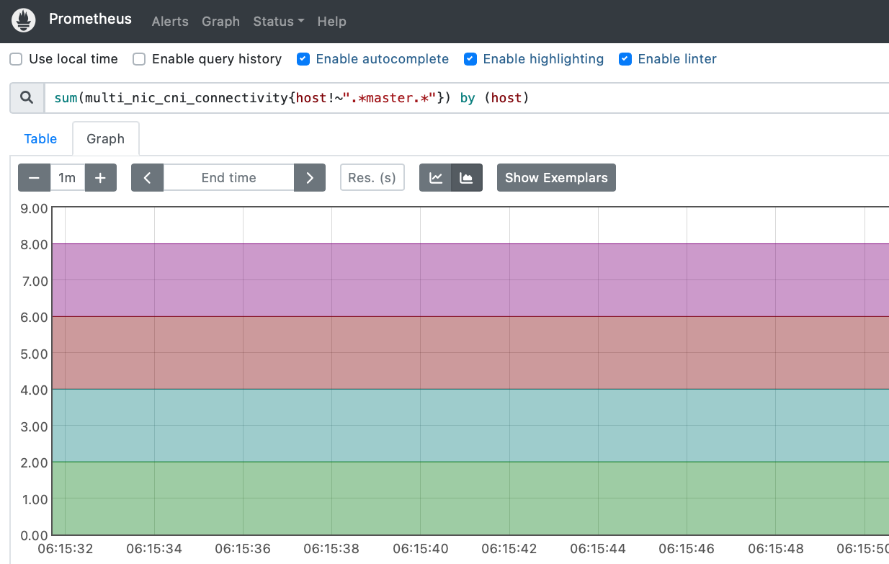

# Multi-NIC CNI Health Check

Default namespace is `multi-nic-cni-operator`. If the namespace is not created, please run

```bash
kubectl create ns multi-nic-cni-operator
```


## Deployment Steps
1. Set security policy to allow TCP communication on port `11001` on Host Primary Network 
2. Clone this repository and move to health-check directory
    
    ```bash
    git clone https://github.com/foundation-model-stack/multi-nic-cni.git
    cd multi-nic-cni/health-check
    chmod +x ./checker/script.sh
    ```

3. Add `openshift.io/cluster-monitoring` label to multi-nic-cni-operator namespace

    ```bash
    kubectl label ns multi-nic-cni-operator openshift.io/cluster-monitoring=true
    ```

4. Run 

    4.1. (optional) specify node (agent) selector
    
    - Modify `agentSelector` in `./checker/configmap.yaml`
    - Add the same selector for `.spec.template.spec.nodeSelector` in `./checker/deployment.yaml`

    4.2. run deploy script

    - Cluster with only single multinicnetwork
        ```bash
        make deploy
        ```

    - Cluster with multiple multinicnetworks

        ```bash
        # deploy health-check agents (used for all multinicnetwork)
        make deploy-agent

        # deploy checker (one deployment per multinicnetwork)
        export NETWORK_NAME=<target multinicnetwork name>
        ./checker/script.sh deploy ${NETWORK_NAME}
        ``` 

    ```bash
    # expected output
    serviceaccount/multi-nic-cni-health-check-agent-sa created
    clusterrole.rbac.authorization.k8s.io/privileged-cr created
    clusterrolebinding.rbac.authorization.k8s.io/multi-nic-cni-privileged-cr-binding created
    daemonset.apps/multi-nic-cni-health-agent created
    serviceaccount/multi-nic-cni-health-checker-sa created
    clusterrole.rbac.authorization.k8s.io/multi-nic-cni-health-check created
    clusterrolebinding.rbac.authorization.k8s.io/multi-nic-cni-health-check-cr-binding created
    service/multi-nic-cni-health-check created
    servicemonitor.monitoring.coreos.com/multi-nic-cni-health-check created
    role.rbac.authorization.k8s.io/multi-nic-cni-health-check-prometheus created
    rolebinding.rbac.authorization.k8s.io/multi-nic-cni-health-check-prometheus created
    clusterrolebinding.rbac.authorization.k8s.io/insecure-prometheus-k8s created
    Set network name multi-nic-network
    deployment.apps/multi-nic-cni-health-checker created
    ```

5. Check whether the health-checker and health-check-agent are running.

    ```bash
    kubectl get po -n multi-nic-cni-operator
    ```

    ```bash
    NAME                                                         READY   STATUS    RESTARTS   AGE
    multi-nic-cni-health-agent-xx                                1/1     Running   0          
    multi-nic-cni-health-agent-yy                                1/1     Running   0          
    multi-nic-cni-health-checker-zz                              1/1     Running   0          
    ```

6. Test status service with port forward

    ```bash
    # forward port on one terminal
    checker=$(kubectl get po -n multi-nic-cni-operator|grep multi-nic-cni-health-checker|awk '{ print $1 }')
    kubectl port-forward ${checker} -n multi-nic-cni-operator 8080:8080

    # request the status check on another terminal. This request will activate the health check signal at the request time.
    curl localhost:8080/status
    ```
    
    Example response:
    > {"HealthyHosts":["hostA", "hostB", "hostC"],"FailedInfo":[{"HostName":"hostD","Connectivity":{"192.168.0.0/18":false,"192.168.64.0/18":false},"Allocability":0,"StatusCode":...,"Status":...,"Message":...}],"CheckTime":"...","Checker":"checkerX"}

    - To get status of specific host:

        ```bash
        # Example of healthy host
        > curl "localhost:8080/status?host=hostA"
        > {"Info":{"HostName":"hostA","Connectivity":{"192.168.0.0/18":true,"192.168.64.0/18":true},"Allocability":2,"StatusCode":200,"Status":"Success","Message":""},"CheckTime":"...","Checker":"checkerX"}

        # Example of unhealthy host
        > curl "localhost:8080/status?host=hostD"
        > {"Info":{"HostName":"hostD","Connectivity":{"192.168.0.0/18":false,"192.168.64.0/18":false},"Allocability":0,"StatusCode":...,"Status":...,"Message":...},"CheckTime":"...","Checker":"checkerX"}
        ```

7. Reload prometheus configuration

    For OpenShift cluster with prometheus operator deployed in openshift-monitoring,

    ```bash
    # forward port on one terminal
    kubectl port-forward prometheus-k8s-0 -n openshift-monitoring 9090:9090

    # request reload on another terminal
    curl -X POST localhost:9090/-/reload
    ```

    > Remark: the manifest is prepared for OpenShift cluster where prometheus is deployed via operator in openshift-monitoring namespace. For exporting to prometheus on other namespace, please modify `./health-check/rbac.yaml`

    Then, you can check two exported metrics via prometheus query on `localhost:9090`.

    **multi_nic_cni_connectivity:** export one if the secondary network interface can be connected to the checker pod via specific network address. otherwise, export zero.
    ```bash
    # total healthy connection observed on each host by specific checker
    sum(multi_nic_cni_connectivity) by (host, checker)
    # list failed connectivity
    multi_nic_cni_connectivity != 1
    ```

    **multi_nic_cni_allocability:** export the number of secondary network interfaces that are successfully created and deleted by the CNI.
    ```bash
    # healthy allocability observed on each host among all checker
    avg(multi_nic_cni_allocability) by (host)
    # list failed allocability
    avg(multi_nic_cni_allocability) by (host) != no. of secondary interfaces
    ```

    
